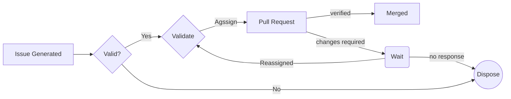

# Title:  Concise yet informative description of the bug

#### Description:

   - Describe the bug in detail, like a detective on the case!
   ->
   - Can you replicate the bug? Show us the steps to reproduce it.
   ->
   - ✅ What were you expecting to happen?
   ->
   - ❌ What actually happened instead? Let's see that glitch!
   ->
   - Images are worth a thousand bug reports (if applicable).
   ->
   - Code snippets can help pinpoint the culprit (if applicable).
   ->

#### Version:

- WordPress version: 
- PHP Version:
- DB Version(if configured): 

#### Labels:

   >Add relevant labels to help us categorize the bug (e.g., bug, high priority).

#### Tracker
> Kindly do not alter details below
- [ ] Valid
- [ ] Assigned
- [ ] PR Generated
- [ ] Verified and Merged
- [ ] Dispose

#### Workflow

