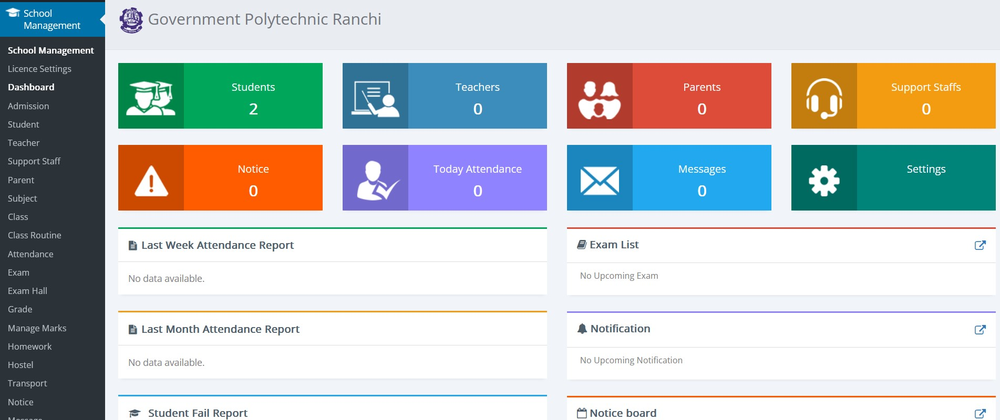

# School Management System (WordPress Plugin)

[](https://www.youtube.com/watch?v=QozxtilDRGc)

School Management System is a comprehensive WordPress plugin designed to streamline the administrative tasks of schools and colleges. It offers a wide range of features to help you efficiently manage various aspects of your educational institution.

## Features

What can be better then a feature video? [Watch Now!](https://www.youtube.com/watch?v=QozxtilDRGc)

- **Admission Management**: Easily manage student admissions, including personal information, academic details, and more.

- **Fee Management**: Keep track of student fees, generate fee receipts, and automate fee reminders.

- **ID Card Generator**: Create student ID cards with ease, complete with student photos and details.

- **mPDF Integration**: Generate PDF documents for various purposes within the system.

- **Attendance Tracking**: Keep records of student and staff attendance effortlessly.

- **Library Management**: Organize and manage your institution's library with ease.

- **Access Rights**: Control user access to specific features and information within the system.

- **Class Scheduling**: Plan and manage class schedules, including subject allocation and teacher assignments.

- **Homework Management**: Assign and track homework assignments for students.

- **Marks and Results**: Record and calculate student marks and generate results.

- **Examination Management**: Manage exams, including scheduling, hall tickets, and result publication.

- **Hostel Management**: Efficiently manage hostel facilities and accommodations.

- **Transport Management**: Keep track of school transport, routes, and schedules.

- **Noticeboard**: Publish notices and updates for students and staff.

- **Messaging System**: Facilitate communication with students, parents, and staff through in-system messaging.

- **Holiday Management**: Manage school holidays and vacations.

- **Backup and Restore**: Ensure data safety with built-in backup and restore options.

## Installation

To use the School Management System WordPress plugin, follow these steps:

1. Download the plugin as a ZIP file from the [GitHub repository](https://github.com/iHRex/school-management).

2. Log in to your WordPress admin panel.

3. Navigate to the "Plugins" section.

4. Click on "Add New" and then "Upload Plugin."

5. Select the ZIP file you downloaded in step 1 and click "Install Now."

6. After installation, click "Activate" to enable the School Management System plugin.

7. Configure the plugin settings, including the options that best suit your institution's needs.

## Usage

Once the School Management System plugin is activated, you can start using its various features to manage your school or college efficiently. Refer to the documentation and user guides provided in the plugin for detailed instructions on how to use each feature.

## Contributions

We welcome contributions from the open-source community to enhance and improve the School Management System WordPress plugin. If you'd like to contribute, please follow these guidelines:

1. Fork the repository.

2. Create a new branch for your changes.

3. Make your changes and commit them.

4. Submit a pull request to the main repository.

>### Contributors using Visual Studio Code (VS Code)
>1. Fork and clone the repository in your local directory
>2. Install the following add-on
>>You can use **[WordPress Playground for VSCode](https://marketplace.visualstudio.com/items?itemName=WordPressPlayground.wordpress-playground)** add-on to make changes, which is available for free on Visual Studio Marketplace, as well as Visual Studio Code (VS Code) Add-on section.
>3. Navigate to Wordpress tab on the left bar of VS Code
>4. Click on ***Start Wordpress Server***

## Demo

>Kindly do not make changes to credentials

User Name: ```Redacted```
Password: ```Redacted```
Demo Link : https://streamlineedu.hrserv.in/wp-admin

## Issues

If you encounter any issues or have suggestions for improvements, please open an issue on the GitHub repository's [issue tracker](https://github.com/iHRex/school-management/issues).

## Discussions

Help needed? or want to discuss something? Head towrds the [discussions](https://github.com/iHRex/school-management/discussions).

## License

This School Management System WordPress plugin is released under the [GNU GENERAL PUBLIC LICENSE](LICENSE.md). You are free to use, modify, and distribute it as per the terms of the license.

## Support

For any questions or support, feel free to contact us at [harsh.v@outlook.in](mailto:harsh.v@outlook.in)

We hope the School Management System plugin helps you efficiently manage your educational institution. Thank you for using our plugin!
